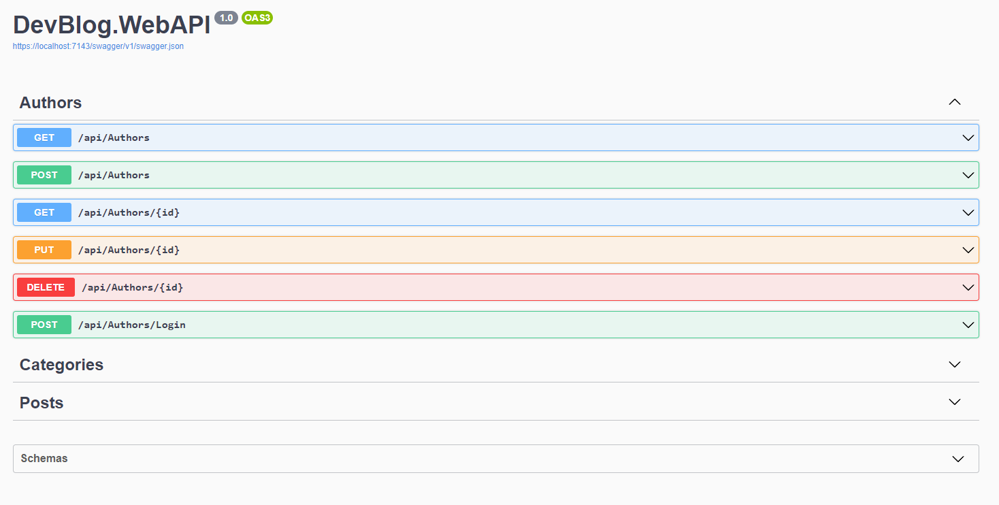

# DevBlog Personal Blog Website

This is a simple personal blog website project which include .Net and VueJS frameworks and MySQL Database. **First version not completed yet. I wait for your contributions **

## Installation

1.  Clone project with this code.

    ```bash
    git clone https://github.com/zkozak34/DevBlog
    ```

2.  Setup database and create database table

    We use MySQL as database in this project so you need to have MySQL server on your system. If you have a Docker, you can use **docker-compose.yml** file. For this go to main folder of project and than run `docker-compose up` command. If you did everything right, can access phpmyadmin with **http://localhost:8081**. After access phpmyadmin, import the **devblog.sql** file to set database tables. Docker-compose.yml file and appsettings.json file in WebAPI include connection string necessary.

    phpmyadmin username: root
    phpmyadmin password: 12345678

3.  Start WebAPI project. For this open the WebAPI project in server folder and than run.

    ```bash
    cd server/DevBlog.WebAPI
    dotnet run
    ```

    A few minutes after run the above command, project will start. Possible address for access **https://localhost:7143**

    You can go Swagger API with https://localhost:7143/swagger and see endpoints. Also you can use Postman Collection file (**DevBlog.postman_collection.json**) in server folder.

    

4.  Now you can start frontend project. Go back main folder to dev-blog project and then run the below command. The following command will download the required packages and run project.
    ```bash
    cd client
    yarn install
    yarn serve
    ```
